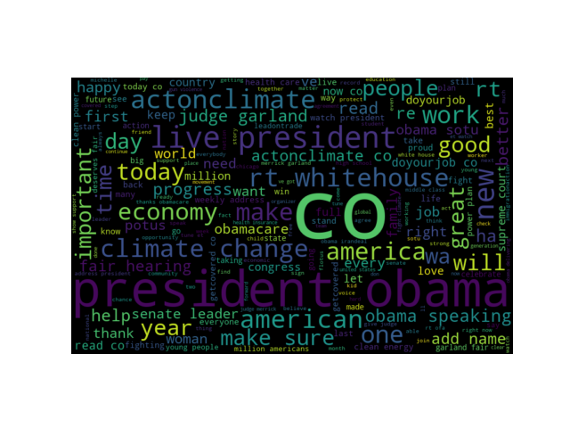

# Twitter Sentiment Analysis
The Goal of this project is to analyse former president Barack Obama's tweets. This was done by collecting the tweets, classifying them as positive, neutral or negative, then generating WordClouds for ease of analysis. Due to the massive amount of data generated by the program computing was carried on over Google Cloud Platform. 

## Data
Data for the sentiment analysis is gathered using Twitter's Tweepy, which is used to connect to gather the tweets through Twitter's API.

## Usage
'gcprun.sh' bash file installs all the required libraries in the virtual machine instance of the cloud. Also you need to create twitter developer account in order to access the API. After creating the developer account, you have the access keys, which you need to save in the 'twitter_auth.py' file. Then running the 'main.py' file would generate three .png files, which are images of WordCloud for 'positive','neutral' and 'negative' tweets.

## WordCloud Images
<html>
  <body>
    
  </body>
</html>
